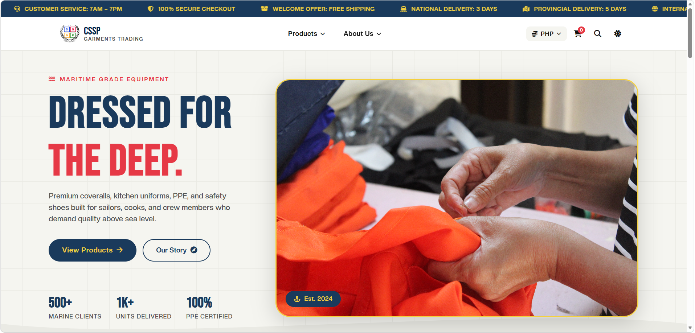
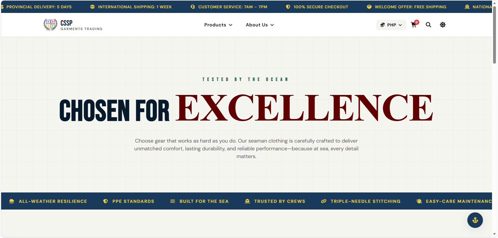
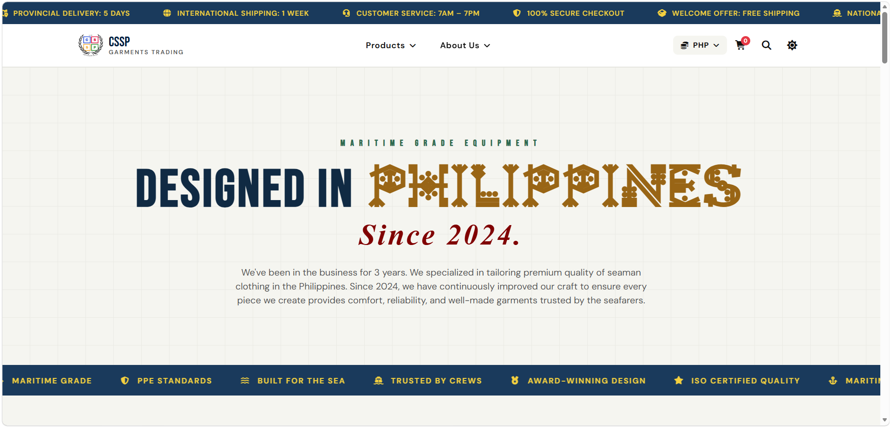
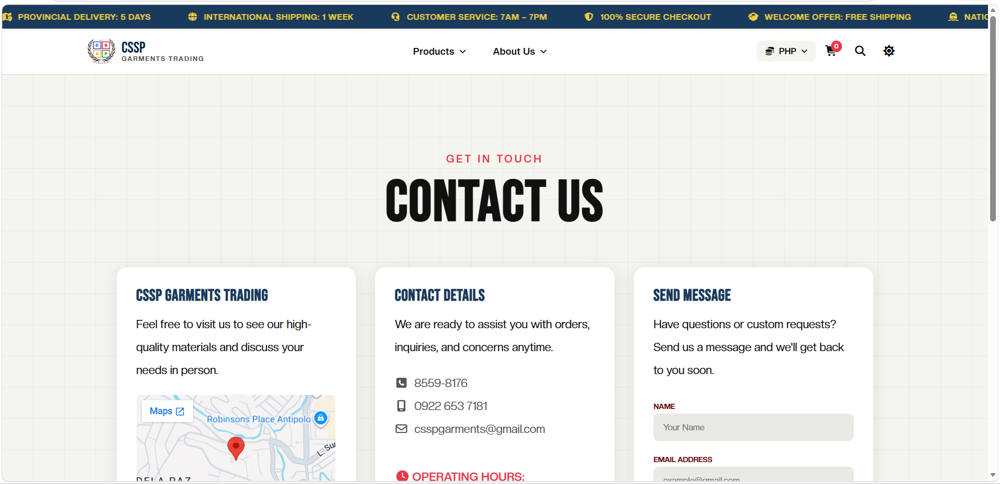

# 🧵 CSSP Garments Trading 🧵

### Student Name: Lagman • Leyble • Pacleb  
**Course & Section: BSIT 1-Y2-4**

---

## Project Description:
**CSSP Garments Trading** is a modern retail website designed to showcase high-quality garments focused on durability, comfort, and style. It provides users with a smooth and engaging browsing experience where they can explore products, learn about the brand, and easily connect with the business.

---

## Features Implemented:
  - Responsive Website Design  
  - Dark Mode Functionality  
  - Mobile-Friendly Layout  
  - Product Section
  - Cart Section 
  - About Us Section  
  - Contact Us / Inquiry Section
  - Policies Section

---

## Website Preview: 

### Home Page

### Products Page

### Cart Page

### About Us Page

### Contact Us/Inquiry Page

### Policies Page

